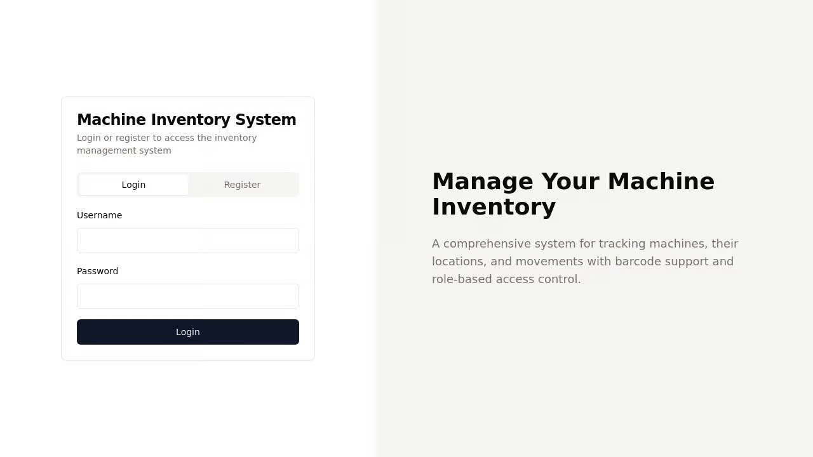

# Machine Inventory Management System 🏭

A comprehensive web-based inventory management system for tracking machines with barcode support and role-based access control. Built with modern web technologies and designed for ease of use.



## ✨ Key Features

- **Role-Based Access Control**
  - 👨‍💼 Admin: Manage machines, types, brands, and transfers
  - 👑 Super Admin: Additional delete permissions and system configuration

- **Dashboard Analytics**
  - 📊 Real-time machine status distribution
  - 📈 Equipment usage statistics
  - 🔍 Recent machine activity tracking
  - 📋 Type-wise inventory summary

- **Machine Management**
  - 🏷️ Barcode-based identification
  - 📍 Location tracking and history
  - 🔄 Status monitoring (New/In Use/Broken/Sold)
  - 📱 Mobile-friendly interface

- **Advanced Features**
  - 🔍 Smart search and filtering
  - 📊 Status-based categorization
  - 🔄 Transfer history logging
  - 📝 Machine type and brand management

## 🛠️ Tech Stack

- **Frontend**
  - React + TypeScript
  - shadcn/ui + Tailwind CSS
  - TanStack Query
  - Wouter for routing

- **Backend**
  - Express.js
  - Passport.js for authentication
  - In-memory storage with session persistence
  - Zod for validation

## 🚀 Getting Started

1. **Clone and Install**
   ```bash
   git clone [repository-url]
   cd machine-inventory
   npm install
   ```

2. **Environment Setup**
   Create a `.env` file:
   ```env
   SESSION_SECRET=your-secret-key
   NODE_ENV=development
   ```

3. **Start Development Server**
   ```bash
   npm run dev
   ```

4. **Access the Application**
   ```
   http://localhost:5000
   ```

## 👥 User Roles & Permissions

### Admin
- View dashboard analytics
- Manage machines (Add/Edit)
- Record machine transfers
- Manage types and brands
- Generate reports

### Super Admin
- All Admin permissions
- Delete machines
- System configuration
- User management

## 🖥️ Main Features Guide

### Dashboard
- Real-time status distribution charts
- Equipment utilization metrics
- Recent activity timeline
- Quick access to common actions

- Real-time statistics
- Status distribution
- Recent machines overview


### Machine Management
- Add new machines with barcode
- Update machine status and location
- View and manage transfers
- Filter and search capabilities

- Barcode scanning
- Status tracking
- Location management
- Transfer history

### Types & Brands
- Create and manage machine types
- Track brand-wise distribution
- Monitor type-specific metrics

## 🔗 API Endpoints

### Authentication
```
POST /api/login    - User login
POST /api/logout   - User logout
GET  /api/user     - Get current user
```

### Machines
```
GET    /api/machines        - List all machines
POST   /api/machines        - Create machine
PATCH  /api/machines/:id    - Update machine
DELETE /api/machines/:id    - Delete machine (Super Admin)
```

### Types & Brands
```
GET  /api/machine-types   - List types
POST /api/machine-types   - Create type
GET  /api/machine-brands  - List brands
POST /api/machine-brands  - Create brand
```

### Transfers
```
POST /api/transfers              - Record transfer
GET  /api/machines/:id/transfers - Get transfer history
```

## 🌟 Status Types

| Status  | Description                    | Indicator |
|---------|--------------------------------|-----------|
| New     | Recently added machines        | 🟢        |
| In Use  | Currently operational          | 🔵        |
| Broken  | Requires maintenance           | 🔴        |
| Sold    | No longer in inventory         | ⚪        |

## 📝 Development Notes

- Uses modern React patterns and best practices
- Implements responsive design principles
- Follows accessibility guidelines
- Includes comprehensive error handling
- Features real-time updates where applicable

## 🔒 Security Features

- Session-based authentication
- Role-based access control
- Input validation and sanitization
- Secure password handling
- CSRF protection

## 🤝 Contributing

1. Fork the repository
2. Create your feature branch
3. Commit your changes
4. Push to the branch
5. Create a Pull Request

## 📄 License

This project is licensed under the MIT License - see the LICENSE file for details.